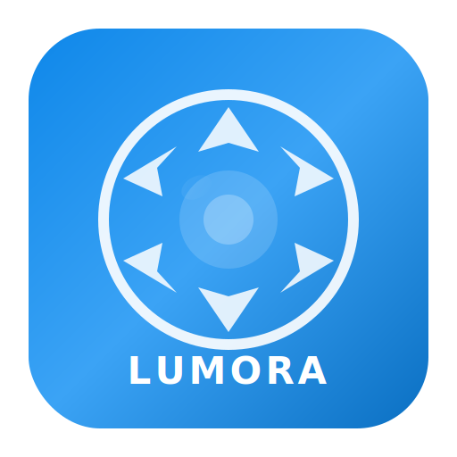

# Lumora Studio Pro

<p align="center">
  
</p>

<p align="center">
  <b>Professional RAW Photo Editor & Asset Manager</b><br/>
  <sub>A modern, open-source alternative to Adobe Lightroom built with Electron, React, and TypeScript</sub>
</p>

<p align="center">
  
  
  
  
  
</p>

---

## ✨ Features

### 📚 Library Module
- **Photo Browser** — Grid and loupe views with responsive layout
- **Catalog System** — SQLite-backed catalog with full metadata indexing
- **Smart Previews** — Automatic thumbnail generation and caching
- **Organization** — Collections, keywords, ratings (1–5 ★), color labels, pick/reject flags
- **Metadata** — Full EXIF/IPTC display and editing
- **Import** — Dialog-based import with folder scanning and duplicate detection

### 🎨 Develop Module
- **Non-Destructive Editing** — All adjustments stored as parameters, original files untouched
- **Basic Adjustments** — White Balance (presets + manual Temp/Tint), Exposure, Contrast, Highlights, Shadows, Whites, Blacks, Vibrance, Saturation
- **Tone Curve** — Interactive point curve editor with per-channel control (RGB, R, G, B) — rendered via LUT texture
- **HSL / Color Mixer** — Hue, Saturation, and Luminance control for 8 color ranges with smooth GPU transitions
- **Color Grading** — Three-way color wheels (Shadows / Midtones / Highlights) with Blending and Balance
- **Detail** — Sharpening (Amount, Radius, Detail, Masking) and Noise Reduction (Luminance, Color) — GPU-accelerated
- **Optics** — Lens Profile Corrections and Chromatic Aberration removal
- **Geometry** — Upright perspective correction (Off / Auto / Level / Vertical / Full), Distortion, manual Transform
- **Effects** — Texture, Clarity, Dehaze, Vignette (Amount, Midpoint, Roundness, Feather, Highlights), Grain (Amount, Size, Roughness)
- **Calibration** — Shadow Tint, Red/Green/Blue Primary Hue and Saturation — all GPU-rendered

### 🤖 AI & Automation
- **Auto Enhance** — One-click AI-powered auto-adjustment that analyzes image luminance, color balance, dynamic range, and saturation to compute optimal edit parameters
- **40+ Built-in Presets** — Organized across 11 categories: Color, B&W, Portrait, Landscape, Street, Film, Creative, Vintage, Cinematic
- **Masking Presets** — 12 built-in mask presets (Dodge, Burn, Soften Skin, Enhance Eyes, Darken Sky, Spotlight, etc.)

### 🎭 Masking & Local Adjustments
- **Brush Masks** — Paint adjustments onto specific areas with size, feather, flow, and density controls
- **Linear Gradient** — Apply graduated adjustments across the image
- **Radial Gradient** — Elliptical masks for targeted spot adjustments
- **Luminosity Masks** — Target adjustments based on brightness ranges
- **Per-Mask Adjustments** — Full adjustment controls per mask: Exposure, Contrast, Highlights, Shadows, Temperature, Tint, Clarity, Dehaze, Saturation, Sharpness, Noise Reduction
- **Mask Overlay** — Toggle visualization of mask areas

### ⚡ Rendering Engine
- **WebGL2 GPU Acceleration** — Real-time preview with advanced GLSL shaders supporting all adjustments
- **Tone Curve via LUT** — Hardware-accelerated tone mapping through 1D lookup texture
- **HSL Per-Channel** — GPU-computed per-hue adjustments with smooth color band transitions
- **3-Way Color Grading** — Shadows/Midtones/Highlights tinting in the fragment shader
- **Canvas Fallback** — Automatic fallback to 2D context when WebGL is unavailable
- **Before / After** — Side-by-side comparison view

### 📤 Export
- **Formats** — JPEG, PNG, TIFF with quality control
- **Resize** — Specific dimensions, percentage, or long edge
- **Watermark** — Text watermark with configurable opacity and position
- **Batch Export** — Export multiple images with consistent settings

### 🔄 History, Presets & Snapshots
- **Unlimited Undo/Redo** — 100-step history stack per image with timestamps
- **Snapshots** — Save and restore named editing states
- **40+ Presets** — Built-in presets across 11 categories, plus user-created presets
- **Copy/Paste** — Copy settings between images

### ⌨️ Keyboard Shortcuts
Full keyboard-driven workflow: rating (0–5), pick/reject/unflag (P/X/U), navigate images (←/→), module switching (G/D), undo/redo (⌘Z/⌘⇧Z), panel toggle (Tab), filmstrip (F), before/after (\\)

---

## Tech Stack

| Layer | Technology |
|-------|-----------|
| Desktop Shell | Electron 33 |
| Frontend | React 18 + TypeScript 5 |
| Bundler | Vite 5 |
| Styling | Tailwind CSS 3 |
| State | Zustand 5 |
| Database | better-sqlite3 (SQLite3) |
| Image Processing | Sharp (server-side) + WebGL (client-side) |
| Metadata | exifr |
| Packaging | electron-builder |

---

## Getting Started

### Prerequisites

- **Node.js** ≥ 18.x
- **npm** ≥ 9.x (or yarn/pnpm)
- **Git**

### Installation

```bash
# Clone the repository
git clone https://github.com/YOUR_USERNAME/lumora-studio-pro.git
cd lumora-studio-pro

# Install dependencies
npm install

# Start development mode
npm run dev
```

This launches Vite dev server on port 5173 and opens the Electron window.

### Build

```bash
# Production build (renderer + main)
npm run build

# Package for your platform
npm run package:mac    # macOS → DMG + ZIP
npm run package:win    # Windows → NSIS + ZIP
npm run package:linux  # Linux → AppImage + DEB
```

---

## Project Structure

```
lumora-studio-pro/
├── src/
│   ├── main/                        # Electron main process
│   │   ├── index.ts                 # Main entry, window creation
│   │   ├── preload.ts               # IPC bridge (contextBridge)
│   │   ├── menu.ts                  # Native application menus
│   │   ├── database.ts              # SQLite catalog database (WAL mode)
│   │   ├── ipc-handlers.ts          # IPC request handlers
│   │   └── image-processor.ts       # Sharp-based image processing
│   │
│   └── renderer/                    # React frontend
│       ├── main.tsx                 # React entry point
│       ├── App.tsx                  # Root layout + keyboard shortcuts
│       ├── components/              # UI components
│       │   ├── TitleBar.tsx         # Custom title bar with traffic lights
│       │   ├── ModuleBar.tsx        # Module navigation with icons
│       │   ├── Toolbar.tsx          # Context-aware toolbar
│       │   ├── CenterView.tsx       # Module content router
│       │   ├── LibraryGrid.tsx      # Photo grid with overlays
│       │   ├── DevelopView.tsx      # Develop canvas with before/after
│       │   ├── Filmstrip.tsx        # Horizontal filmstrip with scroll
│       │   ├── StatusBar.tsx        # Filters, ratings, grid control
│       │   ├── EditSlider.tsx       # Reusable parameter slider
│       │   ├── CollapsiblePanel.tsx # Animated collapsible section
│       │   ├── ToneCurveEditor.tsx  # Interactive point curve editor
│       │   ├── MaskPanel.tsx        # Masking tools & mask list
│       │   ├── ExportDialog.tsx     # Export settings dialog
│       │   └── ImportDialog.tsx     # Import settings dialog
│       ├── panels/
│       │   ├── LeftPanel.tsx        # Navigator, Histogram, Presets, Snapshots, History
│       │   └── RightPanel.tsx       # All editing controls + masking
│       ├── engine/
│       │   └── WebGLRenderer.ts     # WebGL2 GPU rendering (GLSL shaders)
│       ├── stores/
│       │   ├── appStore.ts          # Application state (Zustand)
│       │   ├── editStore.ts         # Edit parameters + undo/redo
│       │   └── maskStore.ts         # Masking state + mask presets
│       ├── hooks/
│       │   └── useHooks.ts          # Custom hooks (debounce, hotkey, resize, etc.)
│       ├── utils/
│       │   ├── autoEnhance.ts       # AI auto-enhancement analysis
│       │   └── presets.ts           # 40+ built-in presets (11 categories)
│       ├── styles/
│       │   └── index.css            # Tailwind + custom styles + animations
│       └── assets/
│           └── logo.svg             # Brand wordmark
├── resources/
│   └── icon.svg                     # Application icon
├── package.json
├── tsconfig.json
├── tsconfig.main.json
├── vite.config.ts
├── tailwind.config.js
└── postcss.config.js
```

---

## Keyboard Shortcuts

| Shortcut | Action |
|----------|--------|
| `G` | Switch to Library |
| `D` | Switch to Develop |
| `\` | Toggle Before/After |
| `Tab` | Toggle side panels |
| `F` | Toggle filmstrip |
| `Cmd/Ctrl + Z` | Undo |
| `Cmd/Ctrl + Shift + Z` | Redo |
| `Cmd/Ctrl + I` | Import photos |
| `Cmd/Ctrl + Shift + E` | Export |
| `+` / `-` | Zoom in/out |
| `0` | Clear rating |
| `1` – `5` | Set star rating |
| `P` | Flag as Pick |
| `X` | Flag as Reject |
| `U` | Unflag |
| `←` / `→` | Previous / Next image |

---

## Architecture Highlights

- **Non-destructive editing** — Original files are never modified. All adjustments are stored as JSON parameters in the SQLite catalog.
- **Dual rendering pipeline** — Server-side processing via Sharp for final export; client-side WebGL2 shaders for real-time preview with advanced GLSL (HSL, Color Grading, Tone Curve LUT, Calibration, Sharpening).
- **IPC isolation** — All file system and database access goes through Electron's IPC bridge with a strict context-isolated preload script.
- **WAL mode SQLite** — Write-Ahead Logging for high-performance concurrent reads during UI rendering.
- **GPU-first approach** — All adjustments rendered in real-time on the GPU via a single-pass fragment shader with 50+ uniforms, minimizing CPU overhead.
- **State management** — Zustand stores with per-image undo/redo stacks, mask state isolation, and snapshot persistence.

---

## License

MIT © Lumora Studio Team
